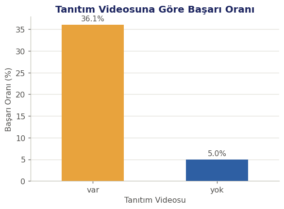
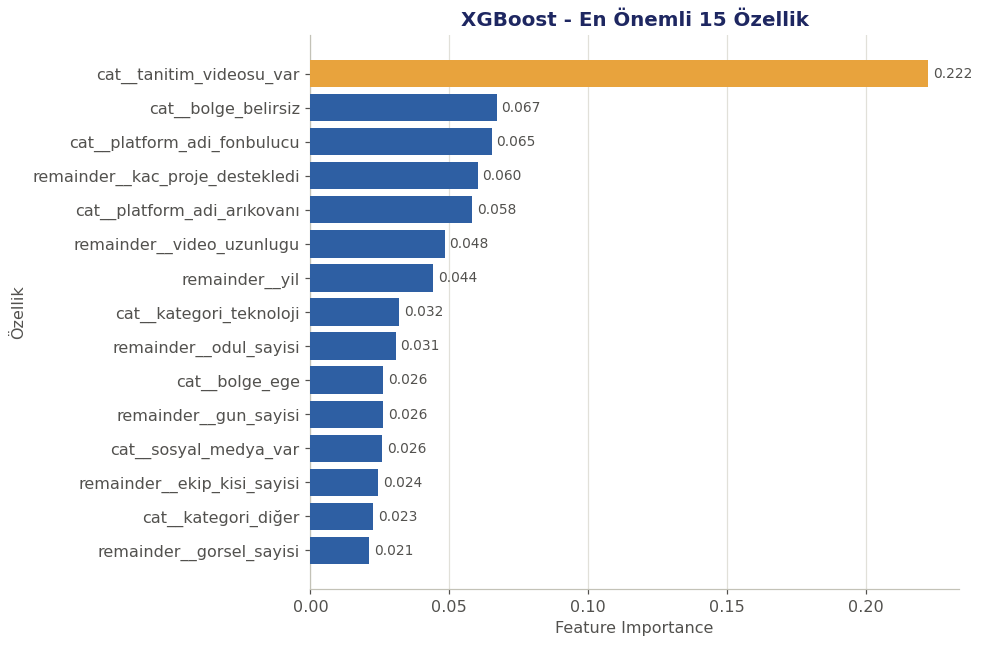

# FundPilot TR

Bir kitle fonlama kampanyası **başlamadan önce**, kampanyaya ait bilinen özellikler kullanılarak kampanyanın **başarılı** ya da **başarısız** olarak sonuçlanacağını tahmin eden uçtan uca bir makine öğrenmesi projesi.

- **Problem türü:** İkili sınıflandırma (Binary Classification)
- **Hedef değişken:** `basari_durumu` (başarılı / başarısız)
- **Final model:** Hiperparametre optimizasyonlu XGBoost
- **Test seti performansı:** Accuracy %84.4 · F1-score 0.653 · Balanced Accuracy 0.772

<p align="center">
  
</p>

## İçindekiler

- [Proje Hakkında](#proje-hakkında)
- [Veri Seti](#veri-seti)
- [Yöntem](#yöntem)
- [Sonuçlar](#sonuçlar)
- [Klasör İçeriği](#klasör-i̇çeriği)
- [Kurulum ve Çalıştırma](#kurulum-ve-çalıştırma)
- [Mini Tahmin Uygulaması](#mini-tahmin-uygulaması)
- [Sınırlılıklar](#sınırlılıklar)

## Proje Hakkında

Kitle fonlama kampanyalarının büyük bölümü hedeflenen tutara ulaşamamaktadır. Bu projede, bir kampanya yayına alınmadan önce bilinen bilgiler (platform, kategori, tanıtım videosu, hedef miktarı, ekip büyüklüğü, bölge vb.) kullanılarak kampanyanın başarı olasılığı tahmin edilmektedir.

Bu tahmin:
- kampanyasını henüz başlatmamış **proje sahiplerine**, kampanya stratejisini gözden geçirme imkânı sunar,
- **kitle fonlama platformlarına**, kampanya onaylama/yönlendirme süreçlerinde bir karar destek girdisi sağlar.

Model kesin bir sonuç garantisi değil; bir **karar destek çıktısı** üretmeyi amaçlamaktadır.

## Veri Seti

- **Dosya:** `turkishCF.csv`
- **Boyut:** 1.628 kampanya, 38 ham sütun
- **Kaynak:** Türkiye'deki kitle fonlama platformlarından (fongogo, crowdfon, fonbulucu, arıkovanı, buluşum, ideanest) derlenmiş kampanya kayıtları
- **Sınıf dengesi:** %76.9 başarısız · %23.1 başarılı (dengesiz veri seti)

Kampanya sonucunu doğrudan yansıtan veya kampanya sürecinde oluşan değişkenler (`toplanan_tutar`, `destek_orani`, `destekci_sayisi`, `guncellemeler`, `yorumlar` vb.) **leakage** riski nedeniyle modelden çıkarılmıştır. Tüm ham sütunların tipi ve anlamı `proje.ipynb` içindeki **Veri Sözlüğü** bölümünde ayrıntılı olarak listelenmiştir.

## Yöntem

1. Veri temizleme, leakage kontrolü, eksik değer ve aykırı değer analizi (IQR + MAD)
2. Keşifçi veri analizi (EDA) — platform, kategori, bölge, tanıtım videosu, hedef miktarı vb. kırılımlarda başarı oranları
3. Baseline model: **Decision Tree**
4. Feature engineering: `dijital_varlik_sayisi` (tanıtım videosu + web sitesi + sosyal medya varlığının toplamı)
5. Hiperparametre optimizasyonu (GridSearchCV), **Random Forest** ve **XGBoost** ile karşılaştırma
6. Model seçimi: 5 katlı stratified cross-validation, F1-score kriteri
7. Karar eşiği optimizasyonu — yalnızca eğitim verisindeki CV olasılık tahminlerinden belirlendi
8. Feature importance ve **SHAP** ile model açıklanabilirliği
9. Yeni kampanya senaryoları üzerinde tahmin ve interaktif mini uygulama (`tahmin_et()`)

## Sonuçlar

Final model olan hiperparametre optimizasyonlu XGBoost, optimize edilmiş %45.1 karar eşiği ile test setinde:

| Metrik | Değer |
|---|---|
| Accuracy | %84.4 |
| Precision (başarılı sınıf) | 0.667 |
| Recall (başarılı sınıf) | 0.640 |
| F1-score (başarılı sınıf) | 0.653 |
| Balanced Accuracy | 0.772 |

<p align="center">
  
</p>

Denenen tüm modellerin karşılaştırması ve cross-validation sonuçları `proje.ipynb` içinde ayrıntılı olarak yer almaktadır.

## Klasör İçeriği

| Dosya | Açıklama |
|---|---|
| `proje.ipynb` | Ana analiz ve modelleme not defteri (27 bölüm: problem tanımından final modele) |
| `turkishCF.csv` | Ham veri seti |
| `fundpilot_final_model.joblib` | Kaydedilmiş final model (XGBoost + karar eşiği + girdi seçenekleri) |
| `FundPilot_TR_Sunum.pptx` | 5 slaytlık proje sunumu |
| `requirements.txt` | Test edilen Python kütüphane sürümleri |
| `assets/` | README'de kullanılan grafik görselleri (notebook çıktılarından) |

## Kurulum ve Çalıştırma

```bash
pip install -r requirements.txt
jupyter notebook proje.ipynb
```

Notebook, `requirements.txt` içinde belirtilen sürümlerle (pandas 2.2, numpy 2.1, scikit-learn 1.6, xgboost 3.4, shap 0.52) test edilmiştir.

Kaydedilmiş modeli tekrar yüklemek için:

```python
import joblib

package = joblib.load("fundpilot_final_model.joblib")
model = package["model"]
threshold = package["threshold"]

olasilik = model.predict_proba(yeni_kampanya_df)[:, 1]
tahmin = int(olasilik >= threshold)
```

## Mini Tahmin Uygulaması

Notebook'un sonunda yer alan `tahmin_et()` fonksiyonu, kampanya bilgilerini adım adım sorar, hatalı kategorik/sayısal girdileri kontrol eder, herhangi bir aşamada `çıkış` yazılırsa uygulamayı düzgün şekilde kapatır ve girilen bilgilere göre başarı olasılığını ve tahmini yazdırır.

## Sınırlılıklar

- Veri seti dengesizdir; bazı kategori, platform ve bölge gruplarında gözlem sayısı düşüktür.
- Model tarafından bulunan ilişkiler **nedensellik göstermez**, yalnızca bu veri setinde gözlenen örüntüleri yansıtır.
- Model, kesin bir yatırım/fonlama kararı değil; kampanya öncesi bir **karar destek aracı** olarak değerlendirilmelidir.

---

*Bu proje, "Uçtan Uca Yapay Zeka Projesi: Veriden Tahmine" eğitim kapsamında geliştirilmiştir.*
